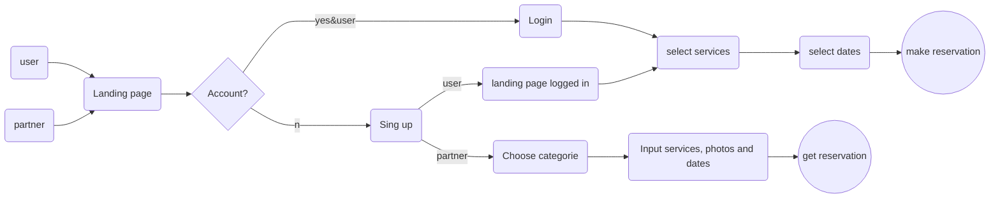

# TuReserva

## The project
TuReserva is a web app created to group services all in one place so people can book what they need when they need it.
### The context
This project is the last step to graduate a 9 month software development program/Foundations at Holberton School in Montevideo, Uruguay. We decided freely who to work with (up to three members) and what to develop. This project was divided in two parts, the first one, to research and define the portfolio project  proposal over the course of 3 weeks, the second one, the building process done in two weeks.
### The team
[Matias Acosta](https://github.com/MatiasAcosta567) - Software engineer passionate about back-end and blockchain. He is the project's architect; in charge of the API endpoints, data modeling and performance.
[Pedro Arbilla](https://github.com/parbilla) - Economist, actor and software developer. He feels very comfortable dealing with logic and is the mathematician of the team, so he provided the best support to both front-end and back-end.
[Atenea Castillo](https://github.com/AteCastillo) - Economist, historian, globetrotter and software developer. She is the front-end expert, focusing in accessibility, interactive elements and user-interface.

### Blogs

## Take a tour

User experience

## Architecture
Back end
Front end

## Acknowledgments

> Written with [StackEdit](https://stackedit.io/).
